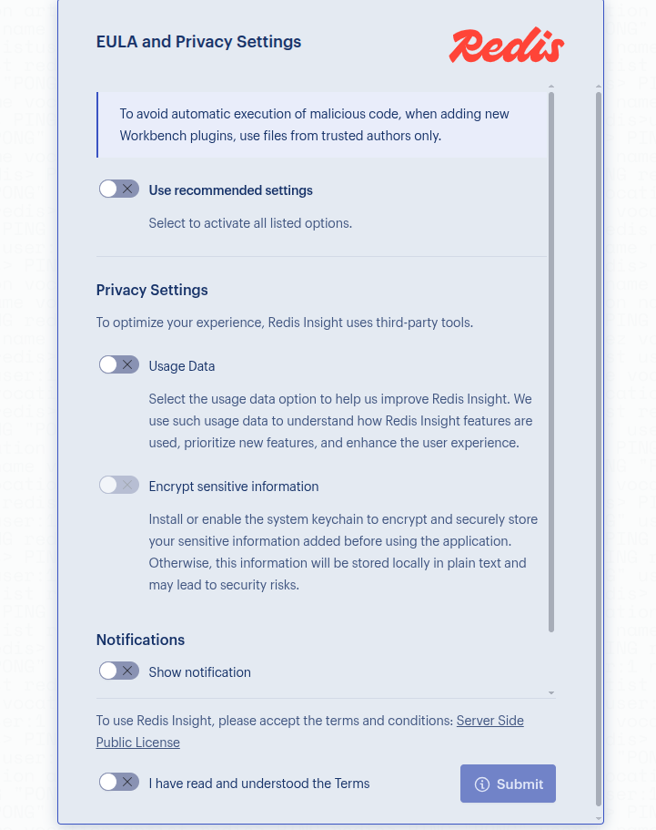
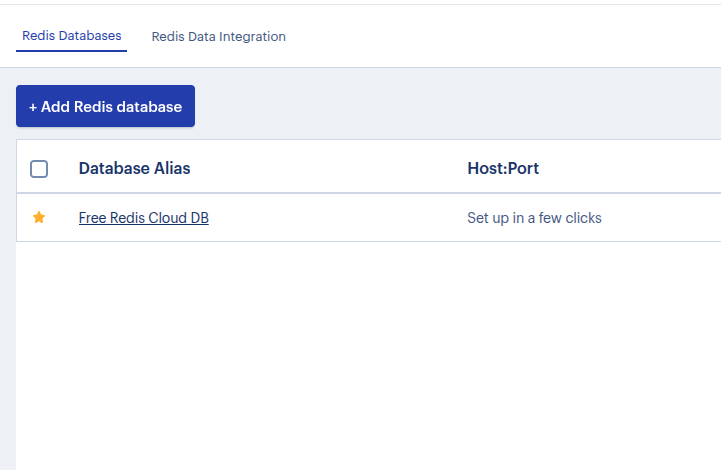
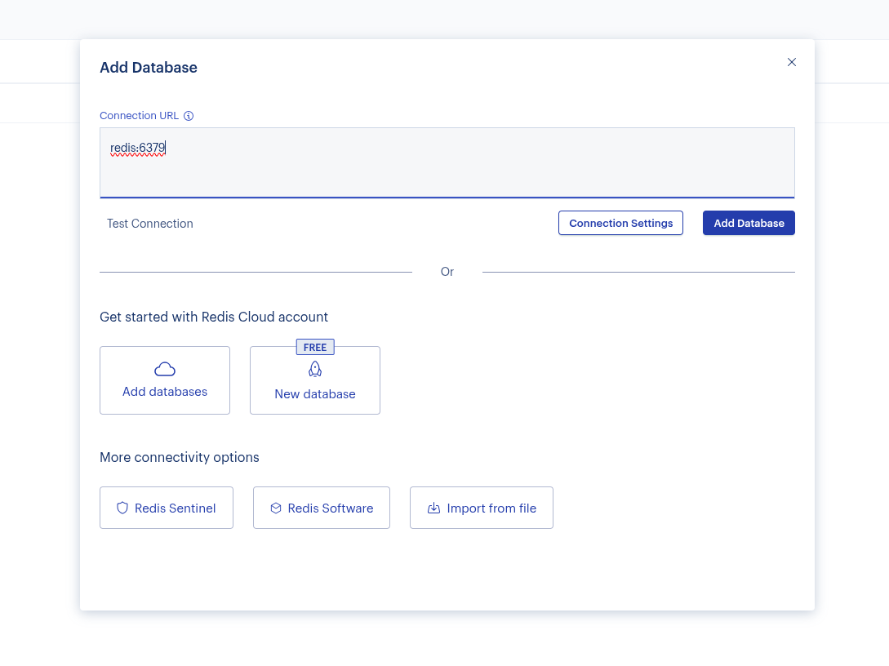
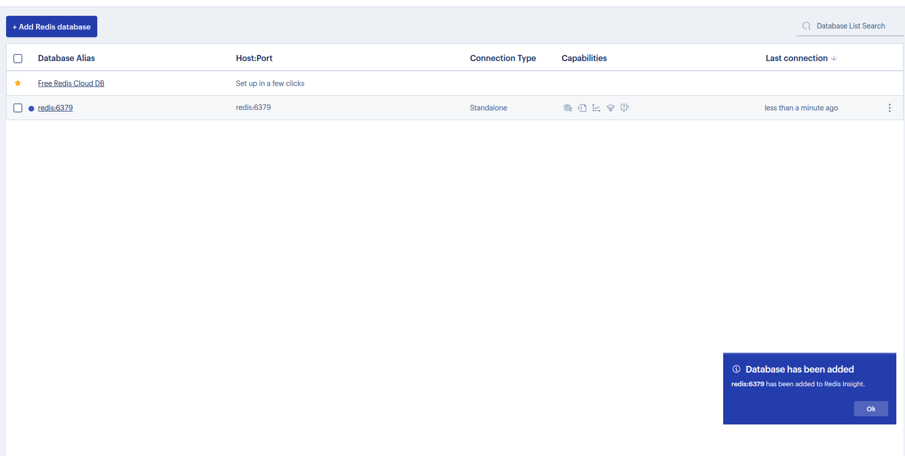

# Redis and RedisInsight with Docker Compose

This guide provides instructions to set up Redis and RedisInsight using Docker Compose.

## Prerequisites

- Docker installed on your system.
- Docker Compose installed.

## Getting Started

1. Clone this repository or navigate to your project directory.

2. Ensure you have the following `redis-docker-compose.yml` file in your directory:

```yaml
services:
  redis:
    image: redis:alpine
    container_name: redis
    restart: unless-stopped
    ports:
      - "6379:6379"
    volumes:
      - redis-data:/data
    environment:
      - INSIGHT_WEB_PORT=8001
    networks:
      - redis-network
    command: ["redis-server", "--appendonly", "yes"]
    healthcheck:
      test:
          - CMD
          - redis-cli
          - ping
      retries: 3
      timeout: 5s

  redisinsight:
    image: redis/redisinsight:latest
    container_name: redisinsight
    restart: unless-stopped
    environment:
      - REDIS_HOST=redis
      - REDIS_PORT=6379
      - REDISINSIGHT_HOST=0.0.0.0
      - REDISINSIGHT_ACCEPT_LICENSE=true  # Accept EULA and Privacy Settings
    ports:
      - "5540:5540"
    volumes:
      - redisinsight-data:/db
    networks:
      - redis-network
    depends_on:
      - redis

volumes:
  redis-data:
    driver: local
  redisinsight-data:
    driver: local

networks:
  redis-network:
    driver: bridge
```

3. Start the services using the following command:

     ```bash
     docker-compose -f redis-docker-compose.yml up -d --build
     ```

4. Verify that the containers are running:

     ```bash
     docker ps
     ```

## Accessing the Services

- **Redis**: Redis will be available on `localhost:6379`.
- **RedisInsight**: Open your browser and navigate to `http://localhost:5540` to access the RedisInsight UI. (It will take 5-10 secs to spin up the container. So wait and reload the broswer page if you didn't see the redisinsght page).


## RedisInsight Login Page

Below is an example of the login page:



Check "use recommended settings" and "Terms" and then "Submit";

After that


and set the redis url to redis:6379 and hit "Add Database"




## Stopping the Services

To stop and remove the containers, run:

```bash
docker-compose -f redis-docker-compose.yml down
```

## Notes

- The `redis-data` volume ensures that Redis data persists across container restarts.
- RedisInsight provides a graphical interface to manage and monitor your Redis instances.

## References

- [Redis Documentation](https://redis.io/documentation)
- [RedisInsight Documentation](https://docs.redis.com/latest/ri/)
